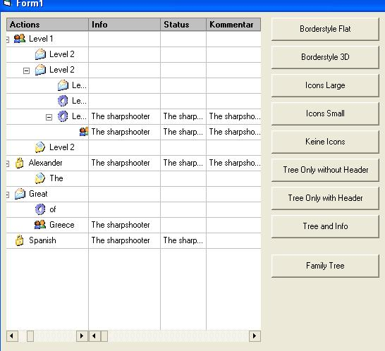



## Custom Treeview and Listview combination

### Description

This is a mix of the Listview and a Treeview. I can be usefull if you want to show associations between datas or something like that... The code is not well commented or there is no comments at all... Its very slow... The next version will be better I promise...
 
### More Info
 

             |
---                |---
**Submitted On**   |2005-09-14 10:58:54
**By**             |[Logan Caino](https://github.com/Planet-Source-Code/PSCIndex/blob/master/ByAuthor/logan-caino.md)
**Level**          |Intermediate
**User Rating**    |4.5 (27 globes from 6 users)
**Compatibility**  |VB 6\.0
**Category**       |[Custom Controls/ Forms/  Menus](https://github.com/Planet-Source-Code/PSCIndex/blob/master/ByCategory/custom-controls-forms-menus__1-4.md)
**World**          |[Visual Basic](https://github.com/Planet-Source-Code/PSCIndex/blob/master/ByWorld/visual-basic.md)
**Archive File**   |[Custom\_Tre1938371072005\.zip](https://github.com/Planet-Source-Code/logan-caino-custom-treeview-and-listview-combination__1-62805/archive/master.zip)

